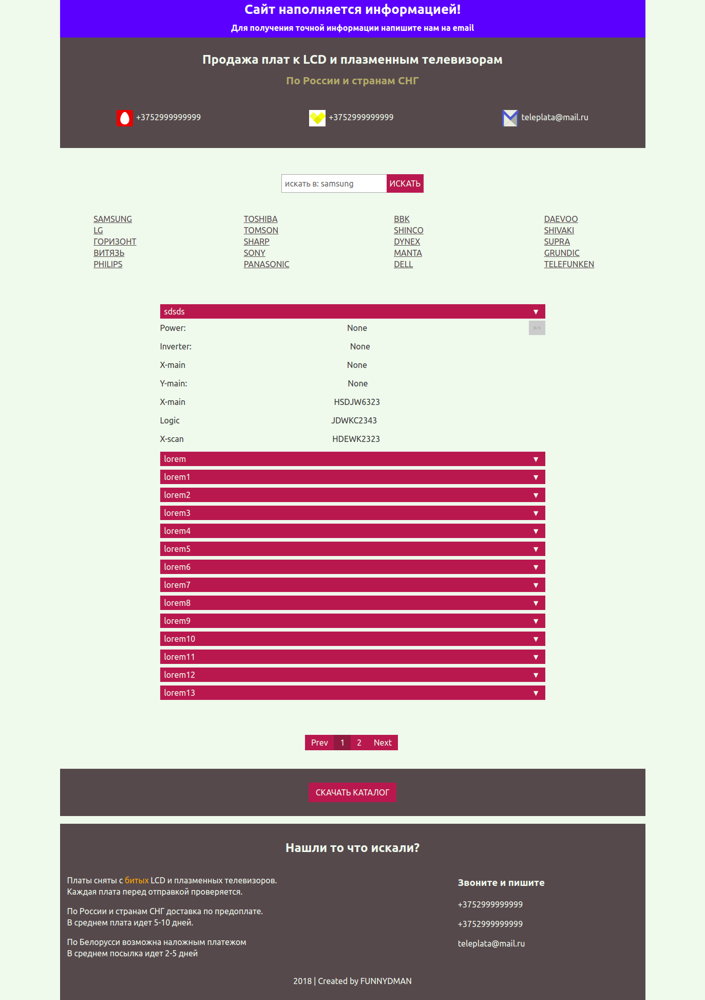

# teleplata
> Site for selling circuits for tv

[](https://travis-ci.org/FUNNYDMAN/teleplata)
[](https://coveralls.io/github/FUNNYDMAN/teleplata?branch=master)
[](https://requires.io/github/FUNNYDMAN/teleplata/requirements/?branch=master)


## Getting Started
1. Create and configure database

```bash
# change user to postgres and run psql tool
sudo -su postgres psql
```

```sql
-- run these commands to create database and user

CREATE DATABASE databasename;
CREATE USER username WITH password 'password'
GRANT ALL ON DATABASE databasename TO username;
ALTER USER username CREATEDB;
```
2. Create python virtual environment and install packages
```bash
# in the project directory execute
virtualenv --python=$(which python3) venv
source venv/bin/activate 
pip install -r requirements.txt

```
3. Run webpack to collect static

Go to ```teleplata/static``` directory and run
```bash
npm install
npm run dev
```

## Screenshots
